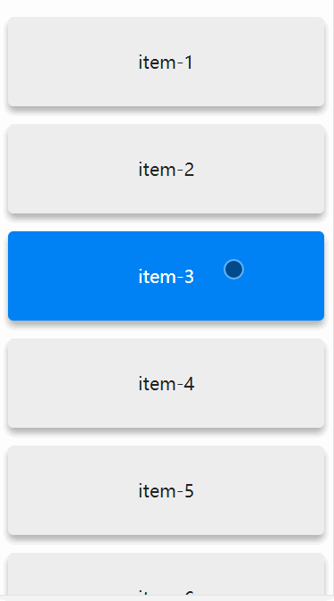

# v-feedback

#### touch feedback directive for vue2.0 



## install
```
npm install v-feedback
```

##### example
```
<!DOCTYPE html>
<html lang="en">
<head>
  <meta charset="UTF-8">
  <stlye>
    .e-feedback {
      background-color: gray;
    }
    
    /* with custom class */
    .my-className {
      background-color: pink;
    }
  </style>
</head>
<body>

  <div id="app">
    <!-- default class "e-feedback" -->
    <div v-feedback></div>
    
    <!-- with custom class "my-className" -->
    <div v-feedback="'my-className'"></div>
  </div>
  
  <script>
    import 'vue';
    import 'v-feedback';
    
    new Vue({
      el: '#app'
    });
  </script>
</body>
</html>

```
